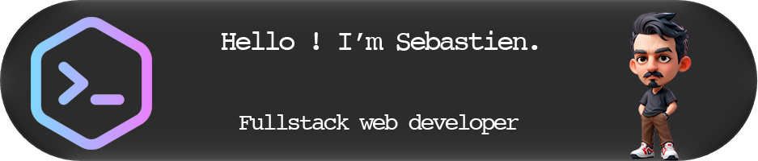

    <h3> Contact</h3>
    <a href="https://www.linkedin.com/in/s%C3%A9bastien-jeanne-dit-denis-13b15b113/">
        
    </a>

    <h3>Languages and Tools</h3>
    <h5>🛠️ Tools</h5>
    &nbsp;
    &nbsp;
    &nbsp;
    &nbsp;
    &nbsp;
    &nbsp;
    &nbsp;
    &nbsp;
    <h5>👨‍💻 Basic skills </h5>
    &nbsp;
    &nbsp;
    &nbsp;
    &nbsp;
    &nbsp;
    &nbsp;
    &nbsp;
    &nbsp;
    <h5>🖥️ Frontend skills </h5>
    &nbsp;
    &nbsp;
    &nbsp;
    &nbsp;
    &nbsp;
    <h5>⚙️ Backend skills </h5>
    &nbsp;
    &nbsp;
    &nbsp;
    &nbsp;
    &nbsp;
    <h5>🗄️ Database skills </h5>
    &nbsp;
    &nbsp;
    &nbsp;
    <h5>➕ Others skills </h5>
    &nbsp;
    &nbsp;
    &nbsp;
    &nbsp;

<!--
Basic skills :

Frontend skills :

Backend skills :

Database skills : 

## Statistiques GitHub

Here are some ideas to get you started:

- 🔭 I’m currently working on ...
- 🌱 I’m currently learning ...
- 👯 I’m looking to collaborate on ...
- 🤔 I’m looking for help with ...
- 💬 Ask me about ...
- 📫 How to reach me: ...
- 😄 Pronouns: ...
- ⚡ Fun fact: ...
### Visitor count
-->

<h3>Visitor count</h3>

<di>

Added the `Mon 21 Dec 2024`

Last update on Fri Jan 02 2026

**364 day before 2027 ⏱** days before new years

🤖 This README.md is updated with horror, by Gitbot ❤️

[Back to top](#top)
